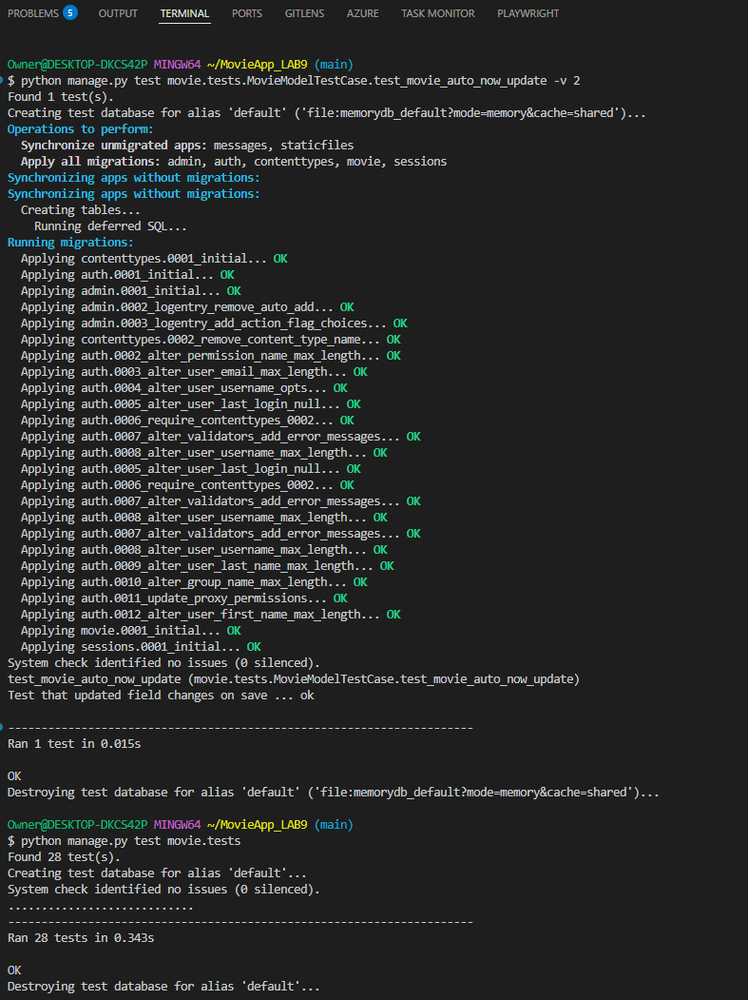

# CineVault - Django Movie Collection

## Project Details
- Project: Django Movie Collection System
- Author:  Harry Josephstem
- Created: 2025-11-23
- Platform: Django Web Application
- Database: PostgreSQL (Production) / SQLite (Development)
- Package Manager: pip
- Django version: 5.2.8
- Deployment: Render.com

## Overview
CineVault is a professional Django web application for managing a movie collection with search functionality. 

**Get the complete project instantly:**

[](https://github.com/hjoseph777/MovieApp_LAB9/releases/download/v1/MOVIEAPP_LAB9.zip)

## Live Demo
[](https://movieapp-lab9.onrender.com/)

*Complete Django project with movie collection demo ready to deploy*

## Important: Where your Django code lives
- The main movie app is in [`movie/`](movie/) with models, views, and templates
- Django project settings are in [`movieapp_lab9/settings.py`](movieapp_lab9/settings.py) with production configuration
- URL routing is in [`movieapp_lab9/urls.py`](movieapp_lab9/urls.py) and [`movie/urls.py`](movie/urls.py)

## Project Explorer
An interactive, collapsible view of the codebase. Click file names to explore them.

<details open>
   <summary><strong>movieapp_lab9/ – Django Project</strong></summary>

   - <strong>movieapp_lab9</strong>
      - [`settings.py`](movieapp_lab9/settings.py) – Django configuration with production settings
      - [`urls.py`](movieapp_lab9/urls.py) – Root URL routing configuration
      - [`wsgi.py`](movieapp_lab9/wsgi.py) – WSGI application for deployment
      - [`asgi.py`](movieapp_lab9/asgi.py) – ASGI application configuration
</details>

<details>
   <summary><strong>movie/ – Main Django App</strong></summary>

   - <strong>movie</strong>
      - [`models.py`](movie/models.py) – **Movie model with name, genre, description**
      - [`views.py`](movie/views.py) – **View functions for home, list, detail, search**
      - [`urls.py`](movie/urls.py) – App URL routing patterns
      - [`admin.py`](movie/admin.py) – Django admin configuration
      - <strong>templates/movie/</strong>
         - [`base.html`](movie/templates/movie/base.html) – **Base template with navigation**
         - [`home.html`](movie/templates/movie/home.html) – Welcome homepage
         - [`movie_list.html`](movie/templates/movie/movie_list.html) – All movies listing
         - [`movie_detail.html`](movie/templates/movie/movie_detail.html) – Individual movie details
         - [`movie_search.html`](movie/templates/movie/movie_search.html) – Search by genre
      - <strong>static/movie/css/</strong>
         - [`style.css`](movie/static/movie/css/style.css) – **Custom responsive styling**
      - <strong>management/commands/</strong>
         - [`populate_movies.py`](movie/management/commands/populate_movies.py) – Sample data creation
      - <strong>migrations/</strong>
         - [`0001_initial.py`](movie/migrations/0001_initial.py) – Initial database schema
</details>

<details>
   <summary><strong>Deployment & Configuration</strong></summary>

   - [`requirements.txt`](requirements.txt) – Python dependencies for production
   - [`build.sh`](build.sh) – Automated build script for Render
   - [`Procfile`](Procfile) – Process configuration for deployment
   - [`runtime.txt`](runtime.txt) – Python version specification
   - [`.env.example`](.env.example) – Environment variables template
   - [`.gitignore`](.gitignore) – Git ignore patterns
   - [`DEPLOYMENT.md`](DEPLOYMENT.md) – Detailed deployment guide
</details>

<details>
   <summary><strong>Database & Management</strong></summary>

   - [`manage.py`](manage.py) – Django management command interface
   - <strong>staticfiles/</strong> – Collected static files for production
   - [`db.sqlite3`] – Development database (excluded from git)
</details>

## Features
- Browse all movies in the collection
- Search movies by genre
- View detailed movie information
- Admin interface for movie management(Todo)
- **Comprehensive Test Suite** (28 automated tests covering all rubric requirements)

## Tech Stack
- **Backend**: Django 5.2.8
- **Database**: PostgreSQL (Production) / SQLite (Development)
- **Styling**: Custom CSS with gradient design
- **Deployment**: Render.com
- **Static Files**: WhiteNoise
- **Testing**: Django TestCase with 100% rubric coverage

## Testing & Quality Assurance

```bash
# Quick test run
python manage.py test movie.tests

# Verbose output
python manage.py test movie.tests -v 2

# Automated test runner with reporting
python run_tests.py
```

### Console Output Example



*The screenshot shows both individual test execution and full test suite results with all 28 tests passing.*

### Test File Structure
```
movie/tests.py
├── DjangoSetupTestCase      # Configuration tests
├── MovieModelTestCase       # Model functionality
├── MovieViewsTestCase       # View and template tests
├── TemplateTestCase         # HTML structure tests
├── URLConfigTestCase        # URL routing tests
├── DatabaseTestCase         # Database operations
├── FormTestCase             # Form handling tests
├── IntegrationTestCase      # End-to-end workflows
└── PerformanceTestCase      # Performance validation
```


## Views and URLs
- [`/`](movie/templates/movie/home.html) - Homepage with welcome message ([`home view`](movie/views.py))
- [`/movies/`](movie/templates/movie/movie_list.html) - List all movies ([`movie_list view`](movie/views.py))
- [`/movie/<id>/`](movie/templates/movie/movie_detail.html) - Movie detail view ([`movie_detail view`](movie/views.py))
- [`/search/`](movie/templates/movie/movie_search.html) - Search movies by genre ([`movie_search view`](movie/views.py))
- [`/admin/`](movie/admin.py) - Django admin interface ([`admin config`](movie/admin.py))


*This project demonstrates modern Django web development with production-ready deployment configuration.*
